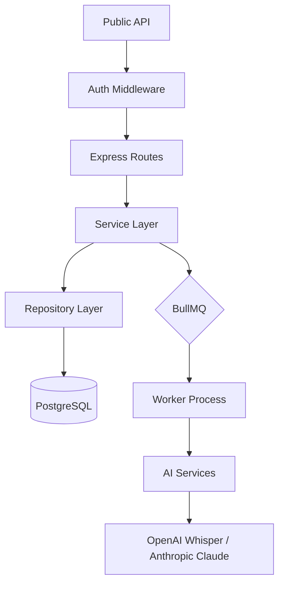

# Architecture: Backend — BBIK MOM Generator

**Primary Framework:** Node.js 21 + Express 4 (ESM)
**Persistence:** PostgreSQL 16
**Scalability:** Redis + BullMQ (Asynchronous Tasks)
**Security:** JWT (JSON Web Tokens) with 100% User Scoping

---

## 1. System Architecture Overview
The backend follows a **Service-Repository** pattern to decouple the API layer from the business logic and database operations.

---

## 2. API Endpoints Specification

### 2.1 Authentication (`/api/auth`)
- **POST `/register`**: Creates a new user record.
    - **Payload:** `{ email, password, name }`
    - **Security:** Bcrypt (hashing), JWT (signed token return).
- **POST `/login`**: Validates credentials.
    - **Payload:** `{ email, password }`
    - **Response:** `{ user, token }`

### 2.2 Task Management (`/api/tasks`) - [PROTECTED]
- **GET `/`**: Lists all tasks for the *currently authenticated user*.
- **GET `/:id`**: Returns task metadata, status (queued, processing, completed, failed), and progress percentage.
- **GET `/:id/download`**: Streams the generated DOCX binary directly to the client.

### 2.3 Audio Pipeline (`/api/minutes`) - [PROTECTED]
- **POST `/process-audio`**: Entry point for meeting minutes generation.
    - **Format:** `multipart/form-data` (audio blob + metadata JSON).
    - **Logic:** Initialises a record in the `tasks` table and pushes a job to the Redis queue.
    - **Response:** `202 Accepted` with `taskId`.
- **POST `/export-docx`**: Direct conversion service for transcript text into formatted DOCX.

### 2.4 Transcription (`/api/transcribe`) - [PROTECTED]
- **POST `/`**: Standalone transcription service via OpenAI Whisper (Large-v3).

---

## 3. Worker Pipeline & AI Workflow (`src/worker.js`)
The worker process handles the computationally expensive AI tasks in the background:

1. **Transcription (Whisper):** 
    - Downloads the audio from the temporary storage.
    - Sends it to the OpenAI API (with chunking support for long tracks).
    - Returns structured text with segment timestamps.
2. **Analysis & Summarization (Claude):**
    - The transcript is processed by the Anthropic Claude 3.5 Sonnet / Opus model.
    - Uses a BBIK-specific system prompt to generate:
        - Meeting Summary
        - Discussion Points (Thai/English)
        - Action Items (Assigned parties + Deadlines)
3. **MOM Fabrication (DOCX):** 
    - The `docx.service.js` builds the final document using the BBIK corporate template logic.
    - The resulting binary buffer is saved to the `task_results` table.

---

## 4. Database Schema Details
- **`users`**: User records with strictly hashed passwords.
- **`tasks`**: Metadata and status tracking. All rows have a `userId` field.
- **`task_logs`**: Incremental progress logs reachable by the frontend.
- **`task_results`**: Final artifact storage (Binary Data).

---

## 5. Security & Isolation Logic
- **Authorization:** Handled via `src/middleware/auth.middleware.js`.
- **Isolation:** The `TaskRepository` enforces a mandatory `user_id` check on *every* database query. It is impossible for one user to access another's tasks or files, even by manipulating `taskId`s.

## 6. Data Retention Policy
To ensure user privacy and minimize storage costs, the system follows a strict data retention policy:
- **Audio Files:** Never stored on disk or in the database. They exist as Base64 strings in **Redis** only during the active processing queue. Once transcription is complete, the BullMQ job is removed, effectively deleting the audio data from the system.
- **Transcripts:** Stored temporarily in the `task_logs` table for user visibility.
- **DOCX Results:** Stored in the `task_results` table until the user deletes the task or clears their history.

---
**Document updated on 2026-03-26 by Kunanan Wongsing**
